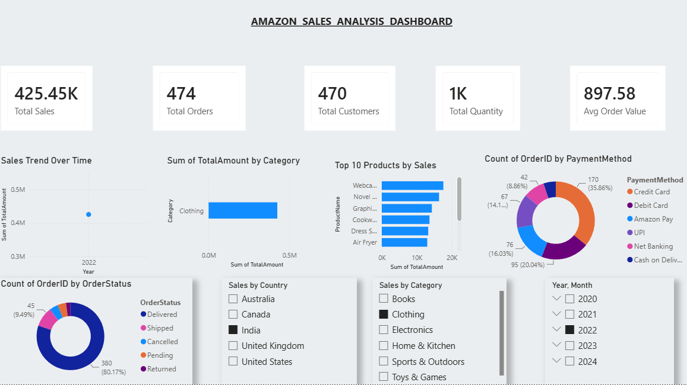

# 📊 Amazon Sales Dashboard

## 📌 Project Overview
This project presents an interactive Power BI dashboard built using Amazon sales data. It provides valuable business insights into sales performance, profit, product categories, and business trends.

## 🛠️ Tools Used
- Power BI
- Power Query
- DAX

## 📈 Dashboard Features
- Total Sales
- Total Profit
- Sales Trend
- Product Category Analysis
- Top Products
- Interactive Filters & Slicers

## 💡 Skills Demonstrated
- Data Cleaning
- Data Transformation
- Data Modeling
- DAX Calculations
- Data Visualization

## 📷 Dashboard Preview

